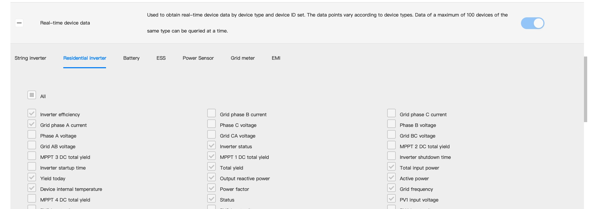

# Fusionsolar data to MQTT
This repository contains files to create docker MQTT client to get and publish data from your huawei inverter (FusionSolar).
Can be integrated with automatization platform that can connect to MQTT broker. (I used openHAB + HUAWEI SUN 2000L)
(this guide needs to be improved, if you have any questions, do not hesitate to contact me)

## Setup
This guide should help you create MQTT client for your huawei inverter to get data.

### Northbound account
First you need to create API account (northbound account) on fusionsolar webapp. For detailed instruction you need to contact huawei support at eu_inverter_support@huawei.com (if you are based in Europe).

#### Select which data you want to get

I used only realtime DEVICE data, becasue it also contains daily production and lifetime production incrementing every specified interval. If you use other methods, it can be updated on the end of the wanted period.

### Docker, docker compose
You need to have docker and docker compose installed.
I used Raspberry Pi 3B+ for this purpose. Please see docker documentation how to install this software for your system.

### Set up env file.
You need to get into **app** directory. Please edit env file as you wish.

First you need to specify username and password of your northbound account (not fusionsolar account):

    FUSIONSOLAR_USR = "usr" #change this
    FUSIONSOLAR_PASS = "pass" #change this

Next there are parameters for MQTT communication.
If you do not know what to change, you need not to changed anything.

    MQTTCLIENT_ID = "fusionsolar" 
    MQTTCLIENT_USR = "mqttuser"
    MQTTCLIENT_PASS = "mqttpass"
    MQTTBROKER_HOST = "host.docker.internal" #change this if you are not using mqtt from this project
    MQTTBROKER_PORT = 1883

Last, you need to specify what you want to publish based on publish objects, device type ids and plant ids. You can get this information from other app from this repository **get_api_info**. If you leave all lists blank, everythink you selected on fusionsolar webapp will be published.

    PUBLISH_OBJECTS = '["DEVICES"]' 
    PUBLISH_DEVICE_TYPE_IDS = []
    PUBLISH_PLANT_IDS = []
    PUBLISH_BASE_TOPIC = "/fusionsolarapi"

    PUBLISH_INTERVAL = 5 #in minutes

### Get api info
To get information what devices are accessible from your northbound account and what data you can get from inverter you can use this app.

First of all, docker and docker compose need to be installed.
Get inside **get_api_info** directory and run

    sh setup.sh

If container in docker exited correctly, go inside **app** directory and then inside **info** directory.

In this directory, there are text files containing all the information you need to set up MQTT client.

**API_info.txt**
\
This file contains stations and devices names and ids.
Example:

    Station: 
        name: plant_name  
        code: plant_code
        Devices:
            device_name: name
            device_id: id                  
            device_type_id: type_id 
            device_inv_type: inverter_type

Other files contains all mqtt publish topics you can access with your subscribers.

